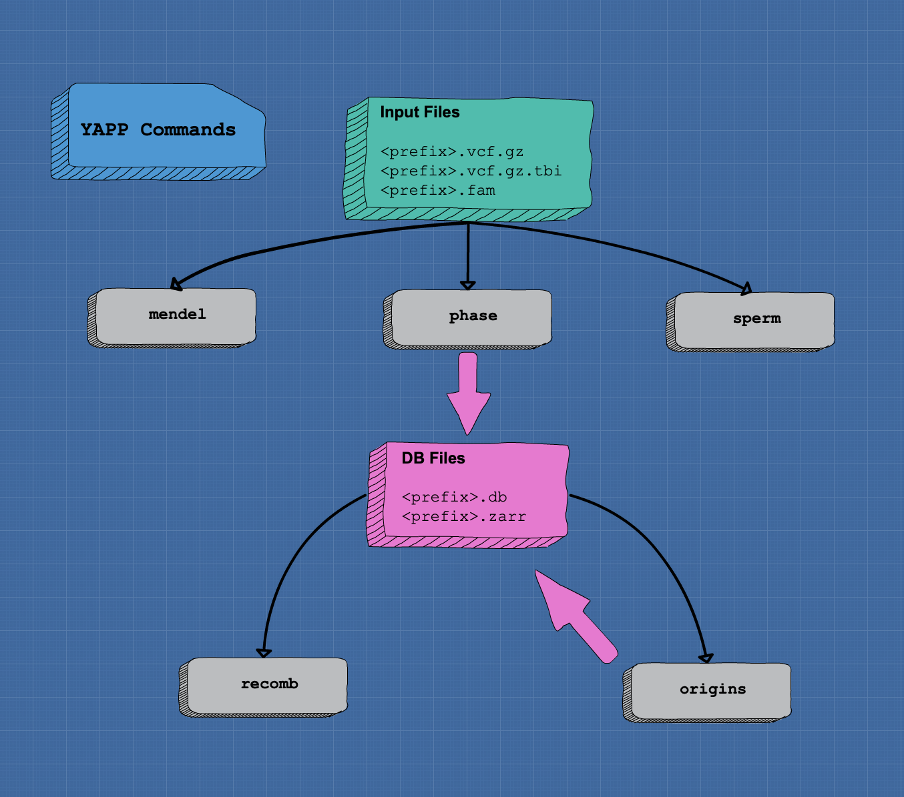

```
 __   __       ___          _____        _____ 
 \ \ / /      / _ \        | ___ \      | ___ \
  \ V /      / /_\ \       | |_/ /      | |_/ /
   \ /       |  _  |       |  __/       |  __/ 
   | |       | | | |       | |          | |    
   \_/et     \_| |_/nother \_|hasing    \_|rogram    

```

## Overview

`yapp` is a program that includes a set of utilities to work on high
density genetic data in pedigrees.

yapp and its utilities implement some models and methods that have been
invented by other people. If you use yapp it is important that you
acknowledge their work by citing the appropriate
references. These will depend on the way you use the software. The
documentation below provides the relevant citations.

## Installation

`yapp` has been tested to work on Linux and MacOSX with python
versions from 3.7 to 3.9 (inclusive).  It is suggested to install `yapp` within a
[python virtual
environment](https://docs.python.org/3/tutorial/venv.html).
Briefly this is done with these commands:

```bash
python -m venv yappenv
cd yappenv
source bin/activate
## make sure a recent version of pip is installed
pip install -U pip
```

Finally, you can install yapp (note that the python package name is yappgen):
           
```bash
pip install yappgen
```

<!---
Or use the latest development version:
         
```bash
git clone git@forgemia.inra.fr:bertrand.servin/yapp.git
cd yapp
pip install .
```
--->

To run some of yapp utilities on a computer cluster you can additionally install `ray` (`pip install ray`)

## Usage

`yapp` has a command line interface that is used to launch different
commands. Type `yapp -h` for detailed help. The basic syntax is :

```bash
yapp <command> <args1, args2, ..., argsN>
```
Most commands take as input files a [VCF file](http://samtools.github.io/hts-specs/VCFv4.2.pdf), its
index obtained with [`tabix`](http://www.htslib.org/doc/tabix.html), and a [FAM
file](https://www.cog-genomics.org/plink/1.9/formats#fam) with family
information. `yapp` writes logs of all commands to a common log file ending in `_yapp.log`. 
This way all steps of an analysis will be logged in the same place (the file is not overwritten).
`yapp` commands try to use multiple processors when required. By default they will use all that are 
available. To control this number use the `-c` option. 

*Workflow of yapp commands*



Available commands are:

### `mendel`

```bash
yapp mendel <prfx>
```

This command performs checks for Mendelian errors between all parent -> offspring pairs. 
It will identify pairs that exhibit a large number of such errors and are therefore 
likely to be pedigree errors. It produces a new FAM file where such errors have been
removed and that can be used in subsequent analyses.

### `phase`

The `phase` command is used to infer gametic phase and segregation
indicators in a genotyped pedigree. The usage is:

```bash
yapp phase <prfx>
```

where `prfx` is the prefix of **all** input files :
`<path/to/prefix>.fam` , `<path/to/prefix>.vcf.gz` ,
`<path/to/prefix>vcf.gz.tbi`. Note that when exporting a `plink` bed
file to VCF, you must do so using `--recode vcf-iid` so that sample
names in the resulting VCF do no include the family-ID.

The output files produced are a phased VCF `<path/to/prefix>_phased.vcf.gz` and a
binary file `<path/to/prefix>_yapp.db`. This binary file is useful
for conducting analyses with other `yapp` commands. `yapp` also stores
the data on disk in the form of `zarr` Zarrays which makes it
convenient to work with and transfer information from one `yapp`
command to another or if you want to access programatically (in
python) the results. When you are finished using it you might consider
deleting those files as they can be big. 

#### Citation
`yapp phase` uses a Weighted Constraints Satisfaction Problem solver,
[ToulBar2](https://miat.inrae.fr/toulbar2/), to infer parental phase
from transmitted gametes. This idea was developped by Aurélie Favier
during her PhD with Simon de Givry and Andres Legarra.

<!-- [Favier, Aurélie (2011). Décompositions fonctionnelles et -->
<!-- structurelles dans les modèles graphiques probabilistes appliquées à -->
<!-- la reconstruction d'haplotypes.](http://thesesups.ups-tlse.fr/1527/) -->

[A. Favier, J-M. Elsen, S. de Givry, and A. Legarra
Optimal haplotype reconstruction in half-sib families
In ICLP-10 workshop on Constraint Based Methods for Bioinformatics,
Edinburgh, UK, 2010 ](https://miat.inrae.fr/degivry/Favier10a.pdf)

### `recomb`

The `recomb` command is used to detect crossing overs from phased
data. It is meant to be run after a `yapp phase` run. It will produce
two output files `<path/to/prefix>_yapp_recombinations.txt` with the
localization of detected crossing over events and
`<path/to/prefix>_yapp_recomb_coverage.txt` that provides for each
meiosis (parent -> offspring) and each chromosome the interval within
which crossing overs can be detected.

### `origins`

*only available for version > 0.1*

The `origins` command is used to trace down transmission of ancestral
alleles in the pedigree. Any chromosome of unknown ancestral origin is
given a unique identifier that is then followed through segregations
from parent to offspring.

This command :

- creates a new `linkage` group in the zarr archive with origins
- produces new output files:
    - `<path/to/prefix>_yapp_ancestors.txt` : correspondance between ancestors
       and ancestral allele codes
    - `<path/to/prefix>_ancestral_props.txt` : for each individual gives the
      proportion of SNPs inherited from each ancestral allele
    - `<path/to/prefix>_pedGRM.txt` : gives the estimated kinship coefficients
      for each pair of individuals in the pedigree. It is a genomic
      relationship matrix (GRM) based on linkage data.

### `sperm`

The `sperm` command is used to infer parental genotype and phases from
genotyping data of its gametes. The input files are the same as for
the `phase` command with additional requirements : 
1. the fam file should not contain pedigree information (columns 3 and
   4 are ignored) but use the FID (/i.e./ first) column to relate an
   individual to its gametes
2. the vcf file will be read assuming individuals are completely
   inbred (haploid gametes). Any heterozygote genotype is treated as
   missing. 

An output file is created for each gamete set found in the input files
(/i.e./ each unique identifier in the FID column of the fam
file). This file is in `tped` format with the additional information that
haplotypes are phased. If you read it with plink the phase info will
probably disappear. 

## Other Utilities

### `fphtrain`

`fphtrain` trains a fastphase model on a set of individuals. It takes
as input a vcf_file (gzipped and indexed) and a number of haplotype
clusters. Genotype data can be read assuming different modes:

- genotype : unphased diploids
- phased : phased diploids. The phase information is taken from the
  VCF file (| sign). Unphased genotype are treated as missing.
- inbred : completely homozygous genotypes, treated as
  haploids. Heterozygote genotypes are treated as missing.
- likelihood : used the GL field from the VCF corresponding to the
  likelihood of each genotype on a PHRED scale (-10*log10(lik)).
  
#### Citation

[Scheet P, Stephens M. A fast and flexible statistical model for
large-scale population genotype data: applications to inferring
missing genotypes and haplotypic phase. Am J Hum
Genet. 2006;78(4):629-644. doi:10.1086/502802](https://www.ncbi.nlm.nih.gov/pmc/articles/PMC1424677/)

If you use the likelihood mode, cite:

[Linkage Disequilibrium-Based Quality Control for Large-Scale Genetic
Studies Scheet P, Stephens M (2008)](https://doi.org/10.1371/journal.pgen.1000147)

© Bertrand Servin 2023
